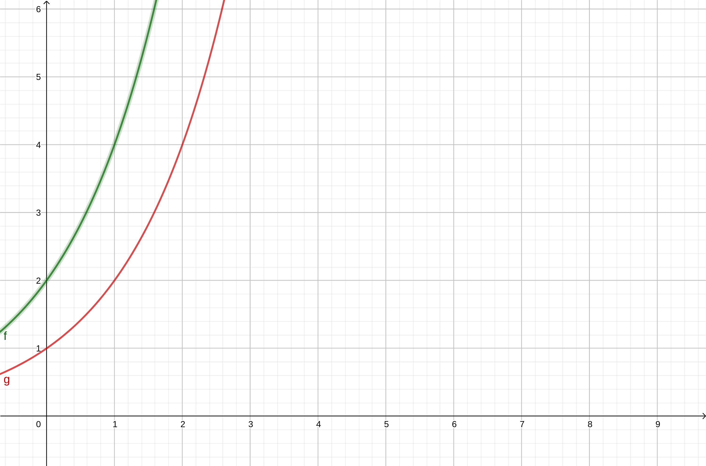
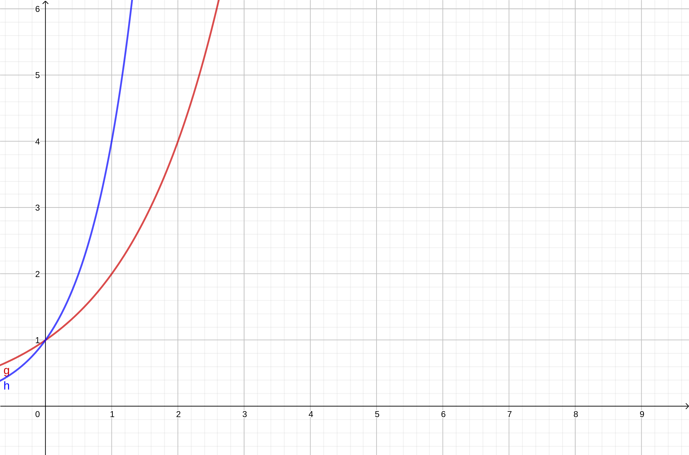
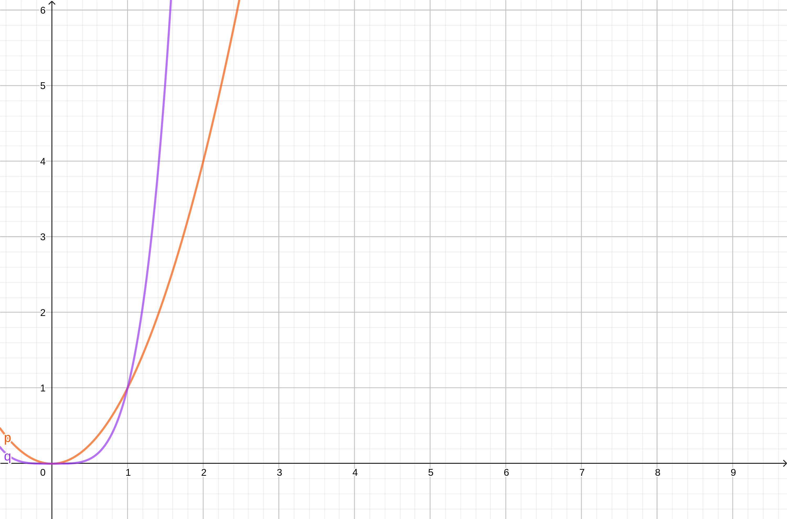

% Atividade 02
% Victor Azadinho Miranda

# 1. Explique por que a declaração “O tempo de execução no algoritmo $A$ é no mínimo $O(n^2)$” não tem sentido.

Pois essa notação não se refere a tempo de execução de um algoritmo, e sim a complexidade no pior caso esperado. Usando-se da complexidade é possível estimar o tempo de execução do algoritmo, mas tal estimativa dificilmente é relevante.

# 2. É verdade que $2^{n+1}=O(2^n)$? Justifique.

Sim.

# 3. É verdade que $2^{2n}=O(2^n)$? Justifique.

Sim.

# 4. Prove que $n^2=o(n^4)$.

Sim, mas somente com $n>1$.

