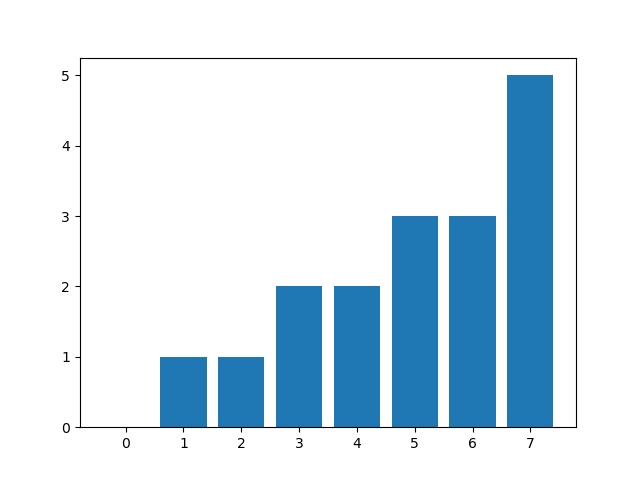

# Exercício 1

Assumindo: $g=6=>I=24$

$g$    $n$    $\sum n$    $q$
---    ----   --------    ---
$0$    $35$   $35$        $0$
$1$    $14$   $49$        $1$
$2$    $22$   $71$        $1$
$3$    $8$    $79$        $2$
$4$    $15$   $94$        $2$
$5$    $9$    $103$       $3$
$6$    $14$   $117$       $3$
$7$    $27$   $144$       $5$

